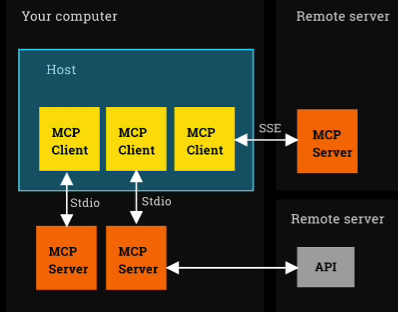

# 🧠 Model Context Protocol (MCP) — Structured Notes

## ❌ What MCP is Not
- Not a framework for building agents
- Not a way to code agents
- Not a fundamental change to how agents work

## ✅ What MCP Is
- A protocol — a standard
- A simple way to integrate tools, resources, and prompts
- Think of it as the USB-C port for AI applications

## 🔑 MCP Core Concepts
MCP is built on three main components:

### Host
- An LLM application (e.g., Claude, or a custom agent architecture)

### MCP Client
- Resides within the Host
- Connects 1:1 to an MCP Server

### MCP Server
- Provides tools, context, and prompts to the Host via the Client

## 📘 Example
`fetch` is an MCP server that searches the web using a headless browser.

You can configure a Claude desktop app (the Host) to:
- Run an MCP client
- That launches the `fetch` MCP server locally on your machine

## 🏗️ MCP Architecture
Here's a simplified architecture diagram:




## Key Questions and Answers

### 1. Who decides which tool to execute in MCP?
**Answer:** Typically the MCP client decides which tool to execute, not the MCP server.

**The Flow:**
1. User makes a request to MCP client
2. MCP client analyzes the request and determines what tools are needed
3. MCP client queries available tools from MCP servers (via `tools/list`)
4. MCP client selects appropriate tool(s) based on tool descriptions
5. MCP client calls the chosen tool on MCP server (via `tools/call`)
6. MCP server executes the tool and returns results
7. MCP client processes results and responds to user

**MCP Server Role:** More passive - exposes tools, executes when called, returns results.

### 2. Is the MCP client always an LLM?
**Answer:** No! MCP clients can be:

**LLM-based MCP clients:**
- Claude acting as MCP client
- ChatGPT with MCP integration
- Other AI assistants using MCP

**Non-LLM MCP clients:**
- Traditional applications/scripts
- Web applications
- Command-line tools
- IDE plugins
- Automation systems
- Custom software

**Key Distinction:**
- LLM-based clients use natural language understanding
- Non-LLM clients use programmed logic, rules, or deterministic methods

### 3. Architecture Analysis from the Code Examples
From the provided `client_sse.py` and `terminal_server_sse.py`:

**Two Client-Server Relationships:**
1. **MCP Client-Server:**
   - Server: `terminal_server_sse.py` (exposes tools)
   - Client: `client_sse.py` (connects to access tools)

2. **AI Model Client-Server:**
   - Server: Gemini API (Google's hosted service)
   - Client: `client_sse.py` (sends queries to Gemini)

**The Flow:**
User Query → client_sse.py → Gemini API
↓
Gemini decides: "I need to use a tool"
↓
client_sse.py → MCP Server → executes tool
↓
Tool result → client_sse.py → Gemini API
↓
Final response → User

### 4. The "Brain and Body" Analogy
Perfect way to understand it:

- **Gemini (LLM) = The Brain 🧠**
  - Understands user requests
  - Decides which tools are needed
  - Reasons about results
  - Generates final responses

- **MCP Client code = The Body 🤖**
  - Connects to MCP servers
  - Discovers available tools
  - Executes tools when brain requests
  - Handles technical communication

  ### 5. Terminology Clarification
**What to call the entire system:**

**Correct Terms:**
- "MCP Client" = Just the protocol implementation code
- "AI Agent" or "LLM-powered MCP Client" = Full intelligent system
- "Assistant" = What users interact with

### 6. Do MCP Clients Always Need LLMs?
**Answer:** NO! MCP clients can work without LLMs.

**Tool Selection Methods:**

**Without LLM:**
```python
# 1. Programmatic Logic
if user_wants_file_list:
    await session.call_tool("run_command", {"command": "ls"})

# 2. User Direct Selection
tool_name = input("Which tool? (run_command/add_numbers): ")
await session.call_tool(tool_name, args)

# 3. Rule-Based Systems
if file_extension == ".py":
    await session.call_tool("python_linter", {"file": filename})
  ```  

**With LLM:**
```python
# LLM decides which tool to call
response = genai_client.models.generate_content(
    contents=[user_query],
    config=GenerateContentConfig(tools=available_tools)
)
# Then execute what LLM decided
```